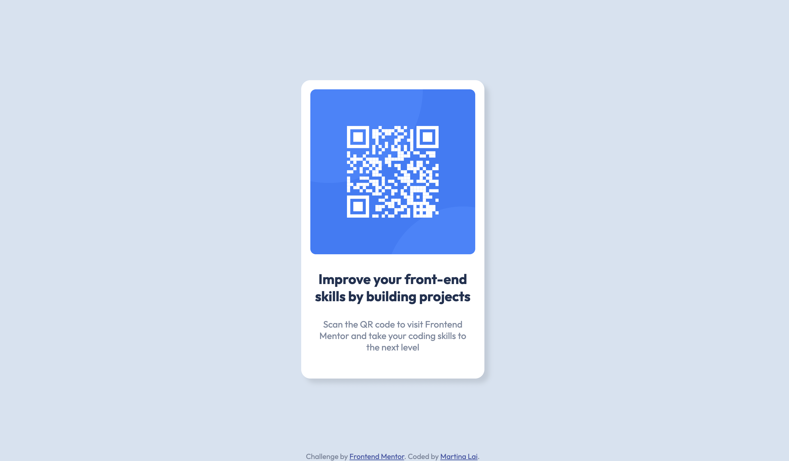

# Frontend Mentor - QR code component solution

This is a solution to the [QR code component challenge on Frontend Mentor](https://www.frontendmentor.io/challenges/qr-code-component-iux_sIO_H). Frontend Mentor challenges help you improve your coding skills by building realistic projects. 

## Table of contents

- [Overview](#overview)
  - [Screenshot](#screenshot)
  - [Links](#links)
- [My process](#my-process)
  - [Built with](#built-with)
  - [What I learned](#what-i-learned)
- [Author](#author)
- [Acknowledgments](#acknowledgments)

## Overview

### Screenshot

### Links

- Solution URL: [Solution URL](https://www.frontendmentor.io/solutions/qr-code-component-tO6doqA3Un)
- Live Site URL: [Live demo](https://martina928.github.io/frontend-mentor-solutions/01-qr-code-component/)

## My process

1. Make the wireframe and plan the class names
2. Setup the HTML structure
3. Apply CSS styles

### Built with

- Semantic HTML5 markup
- CSS custom properties
- Flexbox

### What I learned

This is my first challenge at Frontend Mentor. 

I tried to use BEM naming for the class names, and use relative units rather than absolute units in CSS style. 

I used `margin` attribute for `.card ` to align center in the beginning. However, it would be a problem when the height of viewport shrink. Then, I used `Flexbox` to deal with this question. So that the card will be placed in the center at any viewport size.

## Author

- Website - [Github homepage](https://github.com/Martina928)
- Frontend Mentor - [@Martina](https://www.frontendmentor.io/profile/Martina928)
- Medium - [Martina SayS](https://medium.com/@martina.says)

## Acknowledgments

Thanks Frontend Mentor for the challenges!
