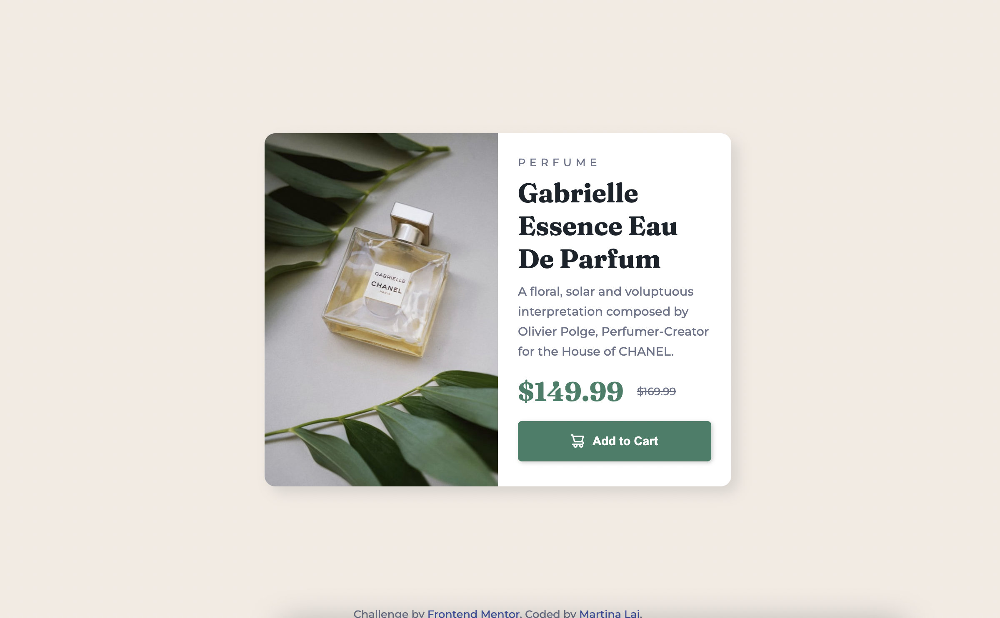

# Frontend Mentor - Product preview card component solution

This is a solution to the [Product preview card component challenge on Frontend Mentor](https://www.frontendmentor.io/challenges/product-preview-card-component-GO7UmttRfa). Frontend Mentor challenges help you improve your coding skills by building realistic projects. 

## Table of contents

- [Overview](#overview)
  - [The challenge](#the-challenge)
  - [Screenshot](#screenshot)
  - [Links](#links)
- [My process](#my-process)
  - [Built with](#built-with)
  - [What I learned](#what-i-learned)
  - [Continued development](#continued-development)
  - [Useful resources](#useful-resources)
- [Author](#author)
- [Acknowledgments](#acknowledgments)

## Overview

### The challenge

Users should be able to:

- View the optimal layout depending on their device's screen size
- See hover states for interactive elements

### Screenshot

### Links

- Solution URL: [Solution URL](https://www.frontendmentor.io/solutions/product-preview-card-component-FDGYA5o-Gd)
- Live Site URL: [Live demo](https://martina928.github.io/frontend-mentor-solutions/02-product-preview-card-component/)

## My process

1. Make the wireframe for viewport of mobile and desktop
2. Plan the class names
3. Setup the HTML structure
4. Apply CSS styles

### Built with

- Semantic HTML5 markup
- CSS custom properties
- Flexbox
- CSS Grid
- Mobile-first workflow

### What I learned

This is my first challenge with RWD design at Frontend Mentor. The break point is 550px by using flex to change the layout.

In the HTML structure, I used to use `
` and change the different background with different viewport sizes. For building semantic HTML markup, I tried to use `<picture> + <source>` tag to set media query. So that the product image can switch in different device without CSS.

### Useful resources

- [[HTML5] Picture element, srcset for Responsive Images](https://pjchender.dev/html/html-picture-srcset/) - This helped me for understanding how to use picture element, srcset and media attribute to deal with responsive images.

## Author

- Website - [Github homepage](https://github.com/Martina928)
- Frontend Mentor - [@Martina](https://www.frontendmentor.io/profile/Martina928)
- Medium - [Martina SayS](https://medium.com/@martina.says)

## Acknowledgments

Thanks Frontend Mentor for the challenges!

